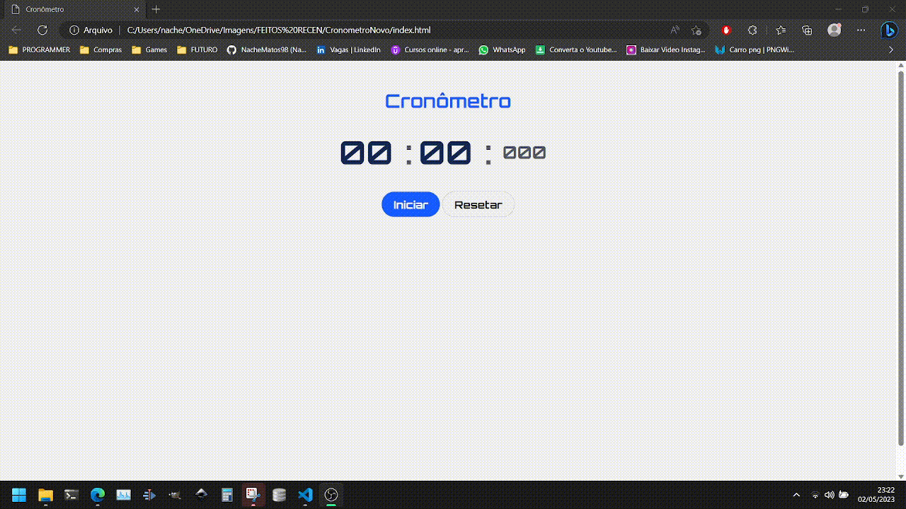

# Projeto - Cronometro Novo

O mini projeto consiste em um simples cronometro, feito com JavaScript puro, HTML e CSS.

- O projeto

 

## 💻 Tecnologias utilizadas
As seguintes ferramentas foram utilizadas na construção do projeto:
- [Javascript](https://developer.mozilla.org/en-US/docs/Web/JavaScript) | [HTML](https://developer.mozilla.org/en-US/docs/Web/HTML) | [CSS](https://developer.mozilla.org/en-US/docs/Web/CSS)
